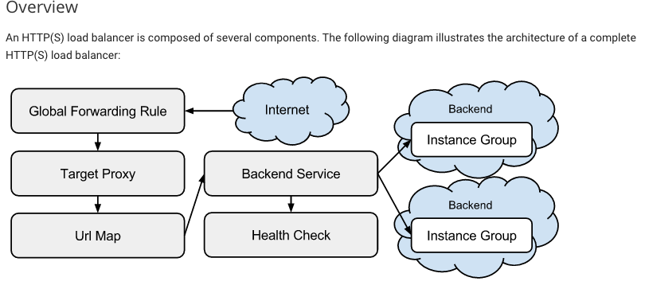
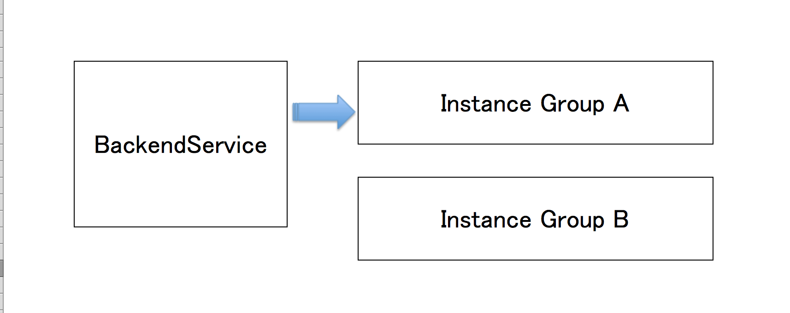
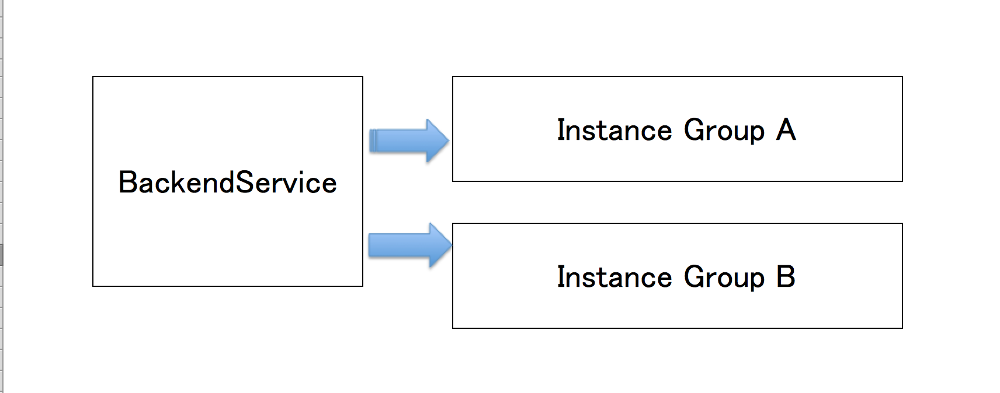
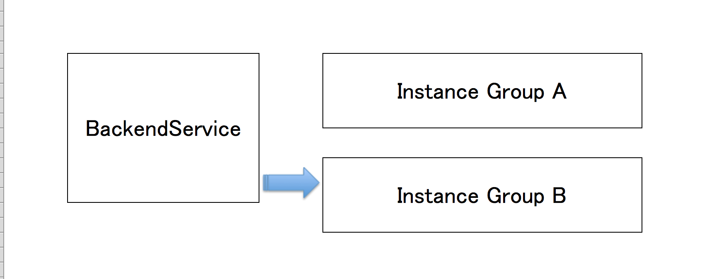

# 今日お話すること

広告配信システムにおけるGCEでのAutoscalerとCloudLoggingの活用事例

------

# もうちょっと具体的にいうと

広告配信システムにおいて、配信の一部でHTTP(S) LB と GCE を利用しています。
このセッションでは、GCE における Autoscaler の利用事例と、CloudLogging を利用したログの収集、解析についてお話します。

------
# 自己紹介

近藤美沙
Twitter @_zoo

VoyageGroupで勤務中
アドテクノチームでDevOps的なことやっています

------
# 少しだけ会社の紹介を

アドテクと言っても、いろいろなサービスがあります。
自分が所属しているのは、fluctと云うサービスの開発チームです。


[http://fluct.jp/](http://fluct.jp/)

------
# 今回お話するシステムの利用用途

 - 広告素材（JS、画像）のCDN　2015/10から本番運用開始
 - インプレッション計測 現在導入検証中

------
# 利用したもの

- [Google Compute Engine](https://cloud.google.com/compute/)
- [HTTP(S) LoadBalancer](https://cloud.google.com/compute/docs/load-balancing/http/)
- [Autoscaler](https://cloud.google.com/compute/docs/autoscaler/)
- [Cloud Monitoring](https://cloud.google.com/monitoring/)
- [Cloud Logging](https://cloud.google.com/logging/docs/)
- [BigQuery](https://cloud.google.com/bigquery/what-is-bigquery)

------
# 今回お話しする上での焦点

- 各リソースの詳細説明はofficial docsに記載されているのでそちらで
- CDNを作る上で最初にはまった部分やどのリソースを使ったかまとめてみた

------

この資料は公開用のものです。
発表時に利用したデモは、サービス環境のものなので、リンクを外してあります。

------
# HTTP(S) LoadBalancer 構成



LoadBalancerを単体で作成するのではなく、図にある構成要素を組み合わせる

------
# Autoscalerの発動条件

Autoscaleのスケーリングポリシーとして、は下記の三種類がある。

- CPU utilization
- Cloud Monitoring metrics
- HTTP load balancing serving capacity

------
## 利用したのはHTTP load balancing serving capacity

1インスタンスのMAX RPSを設定し、MAX RPSのうちX%になったらscaleする。

今回だと、1インスタンスのRPSは7500にして、50%を超えたらスケールするようにしている。
瞬間的な爆発に備えているため、かなり厳しめの値。

CDNはnginxプロセスのみなので、リクエスト数ベースでスケールするようにした。

------
# リリース方法

- 基本はInstance Groupの入れ替え
- Instance GroupはベースのInstance Templateを持っている
- Instance TemplateはベースとなるImageを持っている
- リリースはImageを新しく作成する

------
## リリース準備中



------
## リリース中



------
## リリース終了



------
# リソース管理方法

- gcloudをラップした、独自ツールによる管理
- AWSとも組み合わせていたりするので、両方を管理できるツールが現状だとbetter
- リソース操作のインターフェースはmakeで
- リソースはyamlで管理

------
## サービスリソースはGCPだけでなく、AWSも利用

- DNS => Route53 => AWS
- LoadBalancer => HTTP(S) LoadBalancer => GCP
- Instances => Compute Engine => GCP

------
## インタフェースがmakeとは？

autoscaleの作成とかloadbalancingの設定とか、consoleじゃなくてmakeを叩けば作れるようにしている。
consoleポチポチするのに疲れた人に。

```
make autoscale/create CONF=cdn/prod
make loadbalancing/create CONF=cdn/prod
```

------

## リソースがyamlとは？

- HTTP(S) LBとAutoScaleを利用する上で必要なリソースをsampleとして紹介

------

```haml
#Projectの設定
gcp:
 project: gcp-project-id

 firewall_rules:
   -
     name: all-allow-http
     protocol: tcp:80
     network: app
     description: http
     source_ranges:
      - 0.0.0.0/0
     target_tags: http-server
   -
     name: all-allow-https
     protocol: tcp:443
     network: app
     description: https
     source_ranges:
      - 0.0.0.0/0
     target_tags: https-server

 network:
   name: app
   description: ApplicationNetwork
   mode: custom
   range: 192.168.0.0/16

 certificate:
   name: app-cert-A
   description: ApplicationSSLCertificate
   # 証明書関係は別リポジトリに隠蔽しているので、ここではlocal file pathを記載する
   certificate: certification_file_path
   private_key: key_file_path
```
------

```haml
# Compute Engineの設定
gce:
 autoscale:
   template:
     name: application-templateA
     machine_type: n1-highmem-2
     tags:
       - app
       - http-server
       - https-server
     boot_disk_type: pd-ssd
     image: app-image-A
     network: app

   managed_instance_groups:
     -
       zone: asia-east1-a
       name: app-group-asia-east1-a
       base_instance_name: app-asia-east1-a
       size: 1
       template: application-templateA
       max_num_replicas: 2
       min_num_replicas: 1
       # AutoScallingの閾値 instanceのmax_rpsのうち何%まできたらあげるか決める
       # eg 50%の比率でscaleさせたい場合は、下記のような計算に成る
       #
       #    1,000(max_rps/instance) * 10(replicas) = 10,000
       #    Load Blancing Utilization is 10,000
       #    target_load_balancing_utilization: is 0.5
       #    10,000 * 0.5 - 5,000
       #    意: 5,000RPS/instanceになったら、scaleが発動する
       target_load_balancing_utilization: 0.5
       target: app-group-asia-east1-a
       cool_down_period: 500s
```
------

```haml
# LoadBlancerの設定
 loadbalancing:
   http_health_check:
     name: app-check

   backend_services:
     name: app-service
     max_rate_per_instance: 1000
     balancing_mode: RATE

   url_map:
     name: app-map
     service: app-service

   http_proxy:
     name: app-http-lb-proxy
     map: app-map

   https_proxy:
     name: app-https-lb-proxy
     map: app-map
     cert: cert-A

   forwarding_rules:
     -
       name: app-http-content-rule
       target_proxy: app-http-lb-proxy
       port_range: 80
       address: XXX.XXX.XXX.XXX
       https: false
     -
       name: app-https-content-rule
       target_proxy: app-https-lb-proxy
       port_range: 443
       address: XXX.XXX.XXX.XXX
       https: true
```

-------

# CloudMonitoring

- Agent方式のmonitoring
- disk使用率やmemory使用率を集めてくれる

------

# HTTP(S) LB、AutoScalerのお話しはここまで

------

# ここからは裏方（ログ）のお話し

------

# 広告といえば、ログ。

------

# ログといえば解析。

------

# 解析といえば、よく聞くのはBigQuery

-----
# CloudLoggingのAgent

- google提供のtd-agent
- td-agentの設定サンプルとかごっそり入れてくれる（apache, nginx, puppet, syslog..etc,etc)

-----
## fluentdの設定サンプル

- config.d/配下にあるmatchしたものをgoogle_cloudに流し込む
- private\_key\_email,private\_key\_pathは、service accountのものを利用する
- defaultでは `disable_retry_limit` となっているので、注意

-----

```
$cat /etc/google-fluentd/google-fluentd.conf
# Master configuration file for google-fluentd

# Include any configuration files in the config.d directory.
#
# An example "catch-all" configuration can be found at
# https://github.com/GoogleCloudPlatform/fluentd-catch-all-config
@include config.d/*.conf

# Do not collect fluentd's own logs to avoid infinite loops.
<match fluent.**>
  type null
</match>

# Configure all sources to output to Google Cloud Logging
<match **>
  type google_cloud
  # Set the chunk limit conservatively to avoid exceeding the limit
  # of 2MB per write request.
  buffer_chunk_limit 512K
  flush_interval 5s
  # Never wait longer than 5 minutes between retries.
  max_retry_wait 300
  # Disable the limit on the number of retries (retry forever).
  disable_retry_limit

  # Uncomment the following lines to use service account authentication for
  # the logging agent.
  # See the documentation at https://cloud.google.com/logging/docs
  #
  # After obtaining and installing your private key file, uncomment the
  # following lines and set 'private_key_email' to the service account address.
  #
  # auth_method private_key
  #private_key_email
  #private_key_path
</match>
```

-----
# CloudLoggingでのExport

- td-agent内でしていたtag単位でのexportが可能
- export先は、BigQuery,Google Cloud Storageとか、自分で選べる

-----
# 何がすごいか

- Applicationを作った先の解析基盤は、すでに用意されている
- 愚直にログさえあげれば、数分以内に数十台分のログが解析できる

-----
# まとめ

- GCPでのLB+Autoscale構成は、AWSとちょっと違うが、利用するリソースさえ把握すれば構築は簡単
- CloudLoggingがうまく使えれば集計や解析の基盤構築部分に自分達のリソースを割かなくて良いのは魅力的
- リソース監視としては、サービスで動かす上で必要最低限の物はCloudWatchでカバーできる

-----
# イベントで他の方々のお話聞いての感想

- GKE、GCE、GAE、どれもプロダクションレベルで利用できる段階ではありそう
- 利用事例やdocumentが少ないというのは、使い込んでいる人達でも感じていそう
- もっとoutputしましょう、というモチベーションが高まった
- 次回からは丁寧にスライド作成しよう
